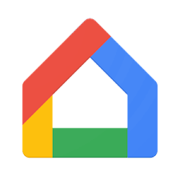

# ioBroker.chromecast

**This adapter uses Sentry libraries to automatically report exceptions and code errors to the developers.** For more details and for information how to disable the error reporting see [Sentry-Plugin Documentation](https://github.com/ioBroker/plugin-sentry#plugin-sentry)! Sentry reporting is used starting with js-controller 3.0.

## A Google Home adapter for ioBroker

This plugin allows to detect video and/or audio Google Home devices. For each detected Home device an ioBroker device is created. This device displays the status of the device and allows to send it a new URL to cast.

Build on top of the following projects:
  * [ioBroker](http://www.iobroker.net)
  * [node-castv2-client](https://github.com/thibauts/node-castv2-client) as Home client library.

## Instructions
1. Install this adapter into ioBroker
2. (optional) If you plan to stream local files or if your chromecast devices are located in a different subnet, you need to configure the adapter
   * you need to have an ioBroker web server instance to stream local files
   * you need to manually add information (name, IP, port, ad type) for each device located in a different subnet than your ioBroker server. If you want names to correspond  to the names of the automatically found devices, use the MAC address as name. You can define any name you want. Make sure, each name is unique! To avoid problems, names should only contain upper case characters A-Z, lower case characters a-z, digits 0-9, - (minus), and _ (underscore).
3. Check your log: you should see logs about the detected devices
4. Write a URL such as [http://edge.live.mp3.mdn.newmedia.nacamar.net/ps-dieneue_rock/livestream_hi.mp3](http://edge.live.mp3.mdn.newmedia.nacamar.net/ps-dieneue_rock/livestream_hi.mp3) to the chromecast.0.`<your chromecast name>`.player.url2play
5. The URL should start playing on your device

## Features
* detect devices with multicast-dns
  * optionally add additional manually configured devices in admin pannel, tab "devices"
* create ioBroker objects for each found device
* status, player, media and metadata channels
* control Google Home device from adapter
  * set volume
  * mute/unmute
  * stop broadcasting
  * pause
  * play url (chromecast.0.`<your Google Home name>`.player.url2play)
    * tested with MP3
      * Full list of formats [here](https://developers.google.com/cast/docs/media).
    * when the url does not start with http then assume that this is a local file
      * export file via ioBroker web server
    * it only plays fist file from playlist files such as .m3u
* Vis widget
  * NOTE: requires [patched vis adapter](https://github.com/angelnu/ioBroker.vis).
* Initial support for Chromecast audio groups
  * Note: this does not work with SSDP -> disable by default in adapter settings
* Play again last played stream: just set _chromecast.0.`<your device>`.status.playing_ to _true_

## What is missing?
* add state machine to track states: detected ->connected -> player loader -> playing
* add retries: sometimes the Google Home fails to respond to a request
* more testing

<!--
  Placeholder for the next version (at the beginning of the line):
  ### **WORK IN PROGRESS**
-->
## Changelog
### **WORK IN PROGRESS**
- (mcm1957) Linting has been updated to @iobroker/eslint-config

### 4.1.0 (2026-02-16)
- (mcm1957) Adapetr requires node.js >= 20 now
- (copilot) Adapter requires js-controller >= 6.0.11 now
- (copilot) Adapter requires admin >= 7.6.17 now
- (mcm1957) Dependencies have been updated

### 4.0.0 (2024-10-09)
* (neopholus) Release 3.4.0 added support for devices located in adifferent subnet. This introduced a problem due to changing some state-ids reported at issue #274. This problem has been fixed. This might be considered a breaking change for some people. 
* (mcm1957) Testing for node.js 22.x has been added.
* (mcm1957) Several issues reported by adapter checker have been fixed.
* (mcm1957) Dependencies have been updated

### 3.4.1 (2024-07-02)
* (foxriver76) migrated binary state to file

### 3.4.0 (2024-04-13)
* (neopholus) Support for devices located in different subnets has been added. [#154, #160]
* (mcm1957) Dependencies have been updated

### 3.3.0 (2024-04-07)
* (mcm1957) Adapter requires node.js 18 and js-controller >= 5 now
* (mcm1957) Dependencies have been updated

## License
The MIT License (MIT)

Copyright (c) 2024-2026 iobroker-community-adapters <iobroker-community-adapters@gmx.de>
Copyright (c) 2015-2022 Vegetto <iobroker@angelnu.com>

Permission is hereby granted, free of charge, to any person obtaining a copy
of this software and associated documentation files (the "Software"), to deal
in the Software without restriction, including without limitation the rights
to use, copy, modify, merge, publish, distribute, sublicense, and/or sell
copies of the Software, and to permit persons to whom the Software is
furnished to do so, subject to the following conditions:

The above copyright notice and this permission notice shall be included in
all copies or substantial portions of the Software.

THE SOFTWARE IS PROVIDED "AS IS", WITHOUT WARRANTY OF ANY KIND, EXPRESS OR
IMPLIED, INCLUDING BUT NOT LIMITED TO THE WARRANTIES OF MERCHANTABILITY,
FITNESS FOR A PARTICULAR PURPOSE AND NONINFRINGEMENT. IN NO EVENT SHALL THE
AUTHORS OR COPYRIGHT HOLDERS BE LIABLE FOR ANY CLAIM, DAMAGES OR OTHER
LIABILITY, WHETHER IN AN ACTION OF CONTRACT, TORT OR OTHERWISE, ARISING FROM,
OUT OF OR IN CONNECTION WITH THE SOFTWARE OR THE USE OR OTHER DEALINGS IN
THE SOFTWARE.
